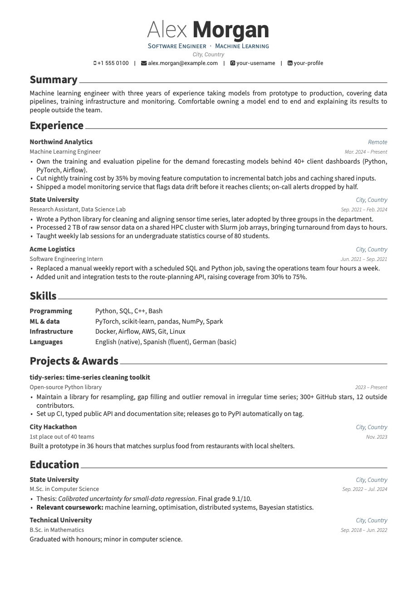
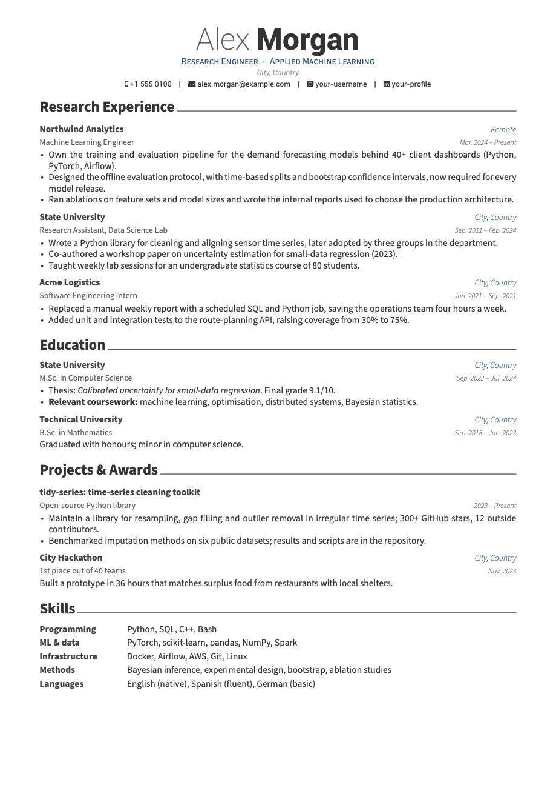

# CV template

A one-page LaTeX CV that builds into several versions from the same content.
Built on [Awesome-CV](https://github.com/posquit0/Awesome-CV) by Claud D. Park.

<p align="center">
  
  
</p>

Both pages come from the same files. The left one is the `industry` variant
and the right one is `research`: same jobs, dates and numbers, but a different
headline, different bullet points and a different section order. Each job,
degree and project lives in its own small file, so a date or a typo only ever
gets fixed once.

## Getting started

1. Click **Use this template** on GitHub, or clone the repository.
2. Install a TeX distribution with XeLaTeX and latexmk: MacTeX on macOS,
   TeX Live on Linux, MiKTeX on Windows.
3. Run `make`. The PDFs end up in `dist/`.

If you'd rather not install TeX, just push. The workflow in
`.github/workflows/build.yml` builds every variant and attaches the PDFs to a
release called `latest`, so these links always point at the newest version:
[industry](../../releases/latest/download/CV-industry.pdf),
[research](../../releases/latest/download/CV-research.pdf).
Change `PDF_NAME` in the workflow to get file names like
`Jane_Doe_CV-industry.pdf`.

## Making it yours

| File | What's in it |
| --- | --- |
| `content/profile.tex` | Name, headline, contact details |
| `content/summary.tex` | The short paragraph at the top of the industry CV |
| `content/experience/`, `education/`, `projects/` | One file per entry |
| `content/skills/` | Rows of the skills table |
| `content/sections.tex` | Which entries go in each section, and in what order |
| `variants/*.tex` | One file per PDF: paper size and section order |
| `styles/theme.tex` | Colours, margins, spacing, text sizes |

Start with `profile.tex`, then replace the sample entries. To add a job, copy
one of the files in `content/experience/`, edit it, and add an `\input` line
for it in `content/sections.tex`. An entry looks like this:

```latex
\cventry
  {Machine Learning Engineer}                 % role
  {Northwind Analytics}                       % organisation
  {Remote}                                    % location
  {Mar. 2024 -- Present}                      % dates
  {
    \begin{cvitems}
      \item {Shown in every variant.}
      \onlyin{industry}{
      \item {Only in the industry CV.}
      }
    \end{cvitems}
  }
```

Two things trip people up: a blank line inside `\cventry` breaks the build,
and `%`, `&`, `$`, `#` and `_` need a backslash in front of them.

## Variants

Each file in `variants/` produces one PDF with the same name. It sets
`\cvvariant` and lists the sections in the order you want:

```latex
\documentclass[11pt,a4paper]{awesome-cv}
\newcommand{\cvvariant}{industry}
\input{content/sections.tex}

\begin{document}
\cvHeader
\cvSummary
\cvExperience
\cvSkills
\cvProjects
\cvEducation
\end{document}
```

The content files then decide what each variant shows:

| Command | Text appears |
| --- | --- |
| `\onlyin{research}{...}` | only in `research` |
| `\except{research}{...}` | everywhere except `research` |
| `\ifvariant{research}{A}{B}` | A in `research`, B everywhere else |

All three take a comma-separated list too, e.g. `\onlyin{research,academic}{...}`.

To add a third version, say for data engineering roles, copy
`variants/industry.tex` to `variants/data.tex`, set `\cvvariant` to `data` and
reorder the sections. `make` and the workflow pick it up without further
changes.

## Changing the look

Most settings are in `styles/theme.tex`, each with a short comment:

- accent colour (Awesome-CV's built-in palette is listed there),
- margins,
- header alignment: left, centre or right,
- space between entries and between sections,
- text sizes.

Paper size is the `a4paper` option in each variant file; use `letterpaper`
for US Letter.

`styles/layout.tex` holds the structural changes to Awesome-CV: list spacing,
the skills table, section rules. `awesome-cv.cls` itself is kept as it was, so
it stays easy to compare with upstream.

## Commands

| Command | Does |
| --- | --- |
| `make` | Builds every variant into `dist/` |
| `make industry` | Builds one variant |
| `make check` | Builds, then fails if a variant runs past one page. Also lists lines that stick out into the margin |
| `make watch VARIANT=research` | Rebuilds on every save |
| `make previews` | Regenerates the images in `docs/` |
| `make clean` | Removes `dist/` |

Going for two pages? `make check MAX_PAGES=2`.

## Editing with a coding agent

`AGENTS.md` describes the layout, the build commands and a few rules: one
page, facts written once, no invented numbers. Most coding agents read it on
their own, and `CLAUDE.md` points Claude Code at the same file. Requests like
these work well:

- "Add my new job at Contoso from March 2025 with three bullets, and drop the
  internship from the industry CV."
- "Make a `data` variant that leads with projects and has no summary."
- "Here's a job description. Tailor the industry variant to it."
- "Switch to a dark green accent and left-align the header."

Whatever made the change, read the PDF yourself before sending it anywhere.

## Credits

- Design and class file: [Awesome-CV](https://github.com/posquit0/Awesome-CV)
  by Claud D. Park ([@posquit0](https://github.com/posquit0)), released under
  the LaTeX Project Public License 1.3c. This repository splits the content
  into variants and adjusts spacing and sizes; the look is Awesome-CV's.
- Fonts in `fonts/`: Roboto by Google (Apache 2.0) and Font Awesome 4 by Dave
  Gandy (SIL Open Font License 1.1). Their licences are in the same folder.
  Body text is set in Source Sans by Adobe, which comes with TeX Live and
  MacTeX.

## Licence

`awesome-cv.cls` remains under the LPPL 1.3c and the fonts under their own
licences. Everything else is MIT, see [LICENSE](LICENSE).
